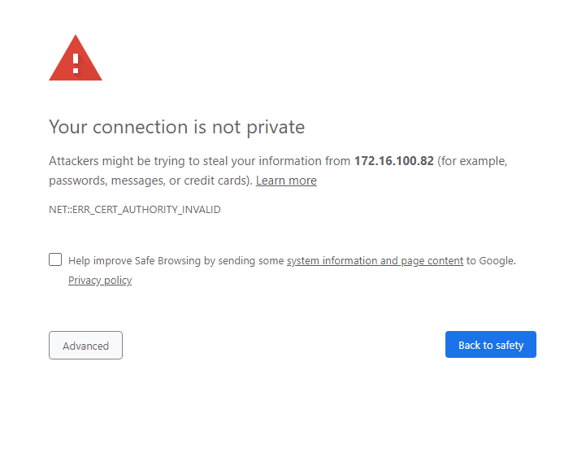
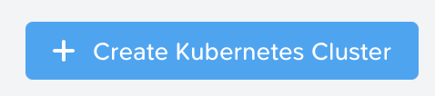
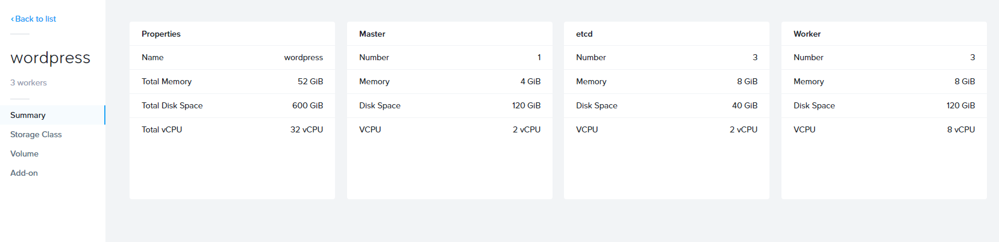
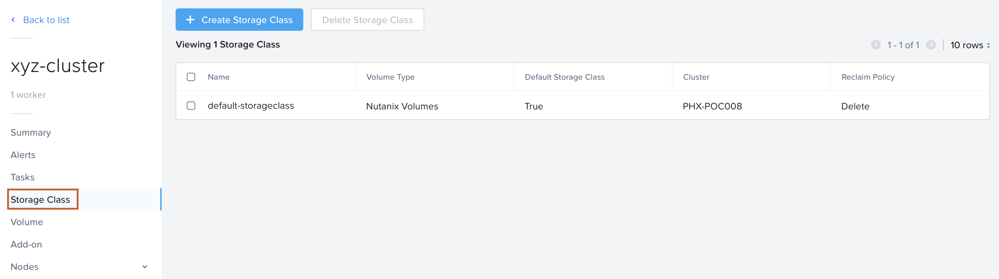
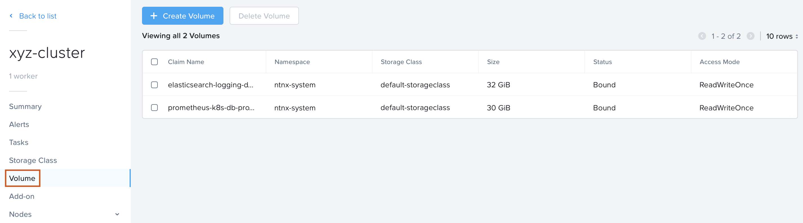
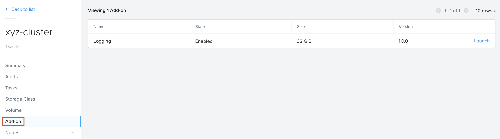

.. Adding labels to the beginning of your lab is helpful for linking to the lab from other pages
.. _create_kube:

-----------------------------
Creating a Kubernetes Cluster
-----------------------------

Overview
++++++++

Before we can deploy an application using kubernetes we need to create a Kubernetes cluster first. The cluster that we are ging to create consists out of the following VMs:

- 1 Master node (VM)
- 1 Worker node (VMs)
- 1 etcd nodes (VMs)

.. note:: For more information on the terms master, worker and etcd, please look at https://kubernetes.io/docs/concepts/.

Creating a Cluster
++++++++++++++++++

In your PRISM Central, select the three dash in the top left corner and select **Service -> Karbon**.

|

A new browser window will open and accept the HTTPS error you will see.

|

In the shown browser screen click on the **+ Create Cluster** button for starting to create the kubernetes cluster.

|

Provide the required parameters that are asked for in the wizard. The following screenshots can be used as a guideline.

.. note:: Where there needs to be more information to explain the settings, it will be provided in notes. You can also hover over the **?** sign to get more information.

|

Choose Development Cluster

Enter a name for your cluster **initials-cluster** and choose your HPOC as **Nutanix Cluster**

|

Provide the Worker, Master and etcd settings as default; click **Next**

|

Provide the Network Provider settings as default; click **Next**

.. note:: We use flannel as the network provider. More information on Flannel can be found here: https://github.com/coreos/flannel#flannel

|

|

Provide the Storage class settings. For the cluster settings use **admin** and the **cluster password** that you used to login to the cluster.

|

Click on the **Create** button to have the cluster created by the system. Follow the process in the Karbon UI.

.. note::
  Based on the resources available on your cluster, it will take time.
  **Wait until the cluster has been created before proceeding to the next part of the module!!**

|

During the creation of the Kubernetes cluster there will have been created:

- VMs

  .. image:: images/10.png

- Persistent Storage as VolumeGroup

  .. image:: images/18.png

  |

  .. image:: images/19.png

Cluster properties
++++++++++++++++++

In the Karbon UI, hover over the just created cluster (wordpress in our example) and click on it.

|

This will open another screen which shows the parts out of which the cluster is created according to the provided parameters that have been provided during the creation phase.

|

The below screenshots provide an example for the three parts, Storage Class, Volume and Add-on.

|

|

|

.. note:: **This concludes the end of this part of the module. You now have a running Kubernetes Cluster called Wordpress.**

___________

Takeaways
+++++++++

- Here is where we summarise any key takeaways from the module
- Such as how a Nutanix feature used in the lab delivers value
- Or highlighting a differentiator
