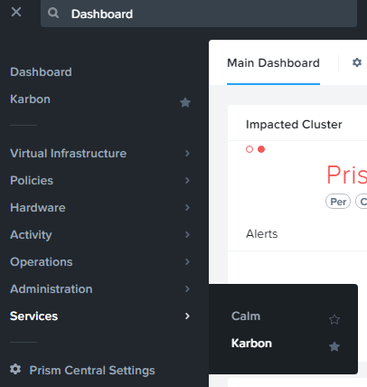
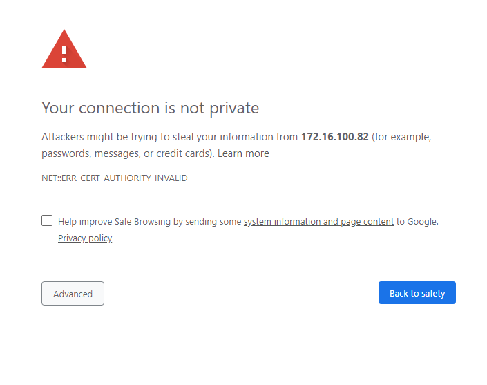
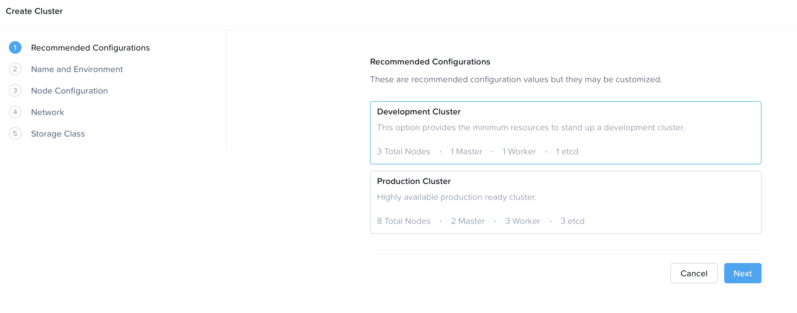
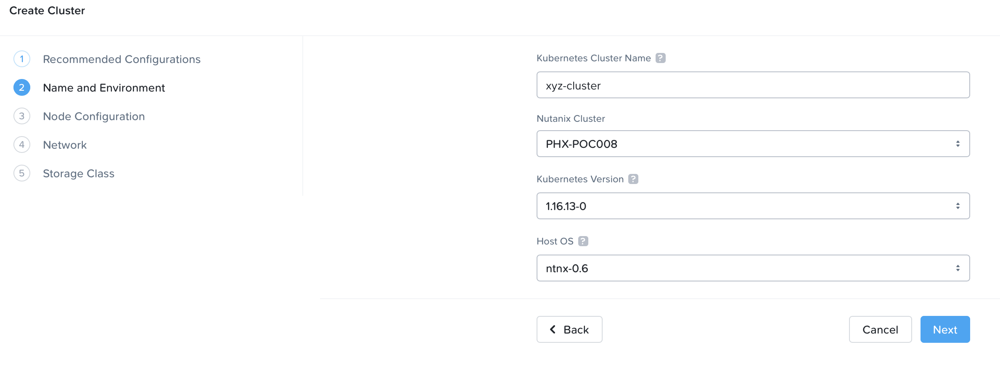
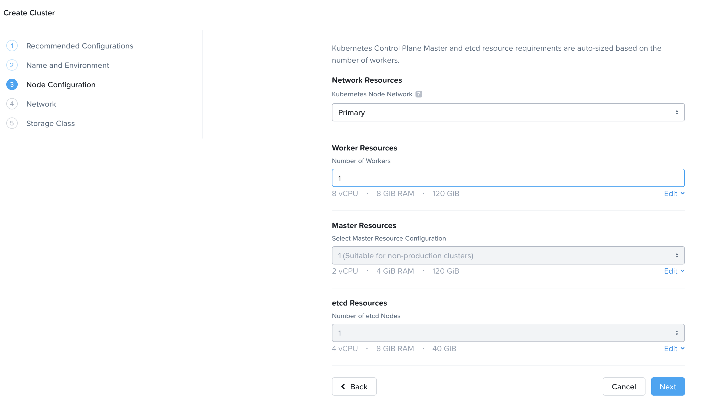
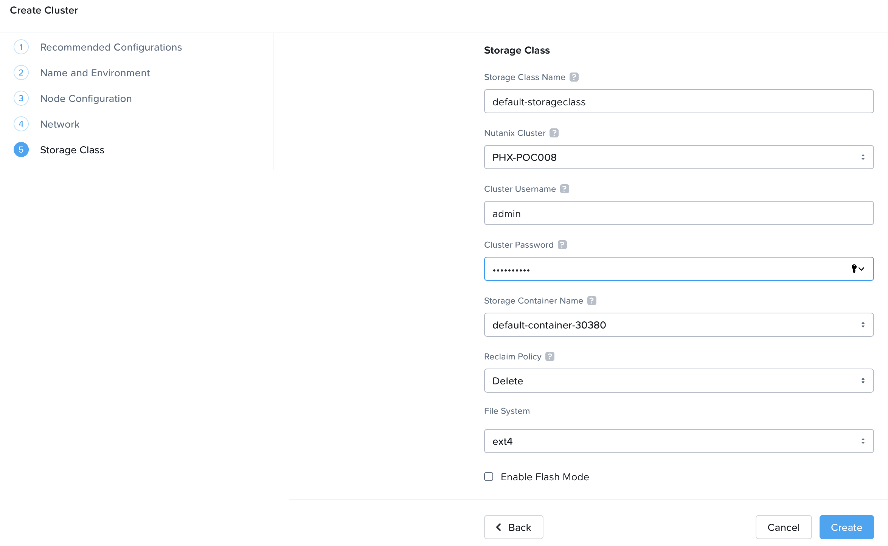

##Overview 

Before we can deploy an application using kubernetes we need to create a
Kubernetes cluster first. The cluster that we are ging to create
consists out of the following VMs:

-   1 Master node (VM)
-   1 Worker node (VMs)
-   1 etcd nodes (VMs)

!!!info
        For more information on the terms master, worker and etcd, please look at https://kubernetes.io/docs/concepts/.

## Creating a Karbon Cluster

1. In your Prism Central, select the three dash in the top left corner and select **Services** > **Karbon**
   
    
   
2. A new browser window will open and accept the HTTPS error you will see.

    

3. In the shown browser screen click on the **+ Create Cluster** button for starting to create the kubernetes cluster

    

4. Provide the required parameters that are asked for in the wizard. The following screenshots can be used as a guideline

    !!!tip
          You can also hover over the **?** sign to get more information.

3. Choose Development Cluster

    

3. Enter a name for your cluster **initials-cluster** and choose your HPOC
as **Nutanix Cluster**

    

4. Provide the Worker, Master and etcd settings as default; click **Next**

    

5. Provide the Network Provider settings as default; click **Next**

    !!!info
            We use flannel as the network provider. More information on Flannel can be found [here](https://github.com/coreos/flannel#flannel)

    

6. Provide the Storage class settings. For the cluster settings use
**admin** and the **cluster password** that you used to login to the
cluster.

    

7. Click on the **Create** button to have the cluster created by the
system. Follow the process in the Karbon UI.

    !!!note
            Based on the resources available on your cluster, it will take
            time. **Wait until the cluster has been created before proceeding to the
            next part of the module!!**

    

During the creation of the Kubernetes cluster there will have been created:

-   VMs

     

-   Persistent Storage as VolumeGroup

     

     

## Cluster properties

In the Karbon UI, hover over the just created cluster (**initials-cluster** in our example) and click on it.

This will open another screen which shows the parts out of which the
cluster is created according to the provided parameters that have been
provided during the creation phase.

The below screenshots provide an example for the three parts, Storage
Class, Volume and Add-on.

This concludes the end of this part of the module. You now have a running Kubernetes Cluster.

## Takeaways

-   It is quite easy to create a kubernetes cluster using Nutanix Karbon
-   Both Development and Production cluster with different node count
    options are available
-   Flannel is the only CNI option available in the Karbon GUI. However,
    Calico is avaialble to configure through REST API calls
