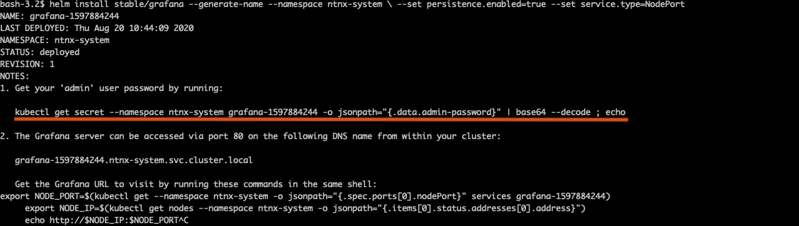
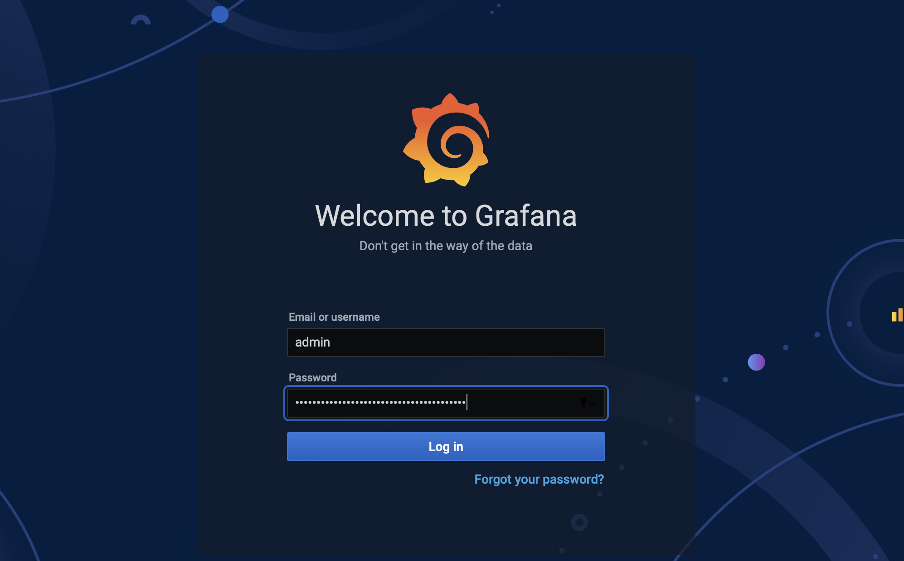
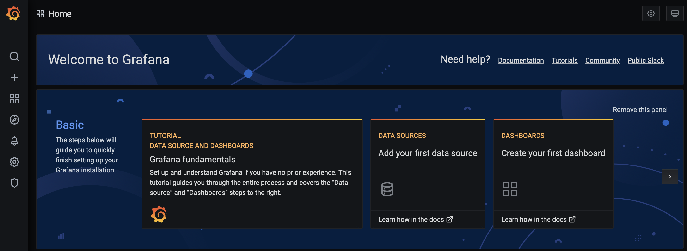
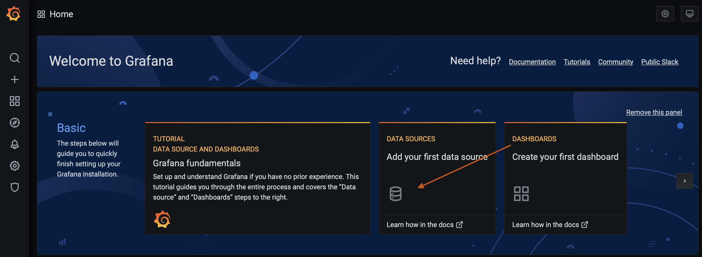
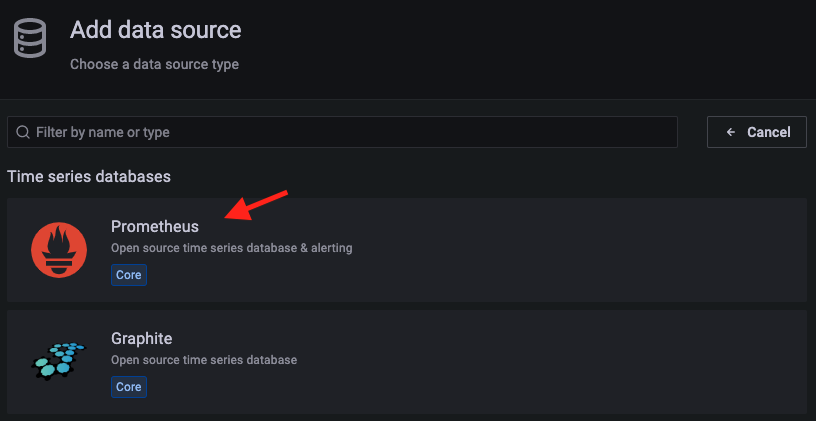
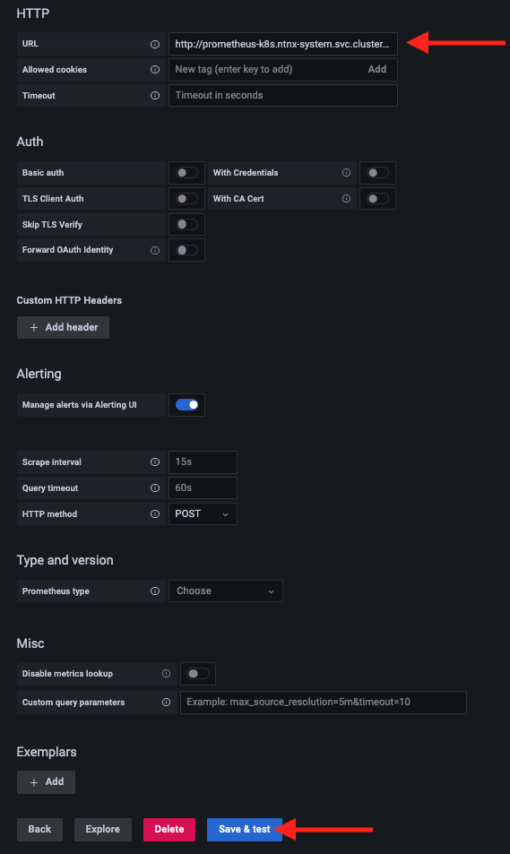
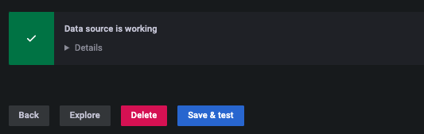

In this exercise we will install Grafana into the same ``ntnx-system`` namespace using Helm. 

If you haven't got Helm deployed use these [instructions](../appendix/helm.md) to deploy it in your Linux Tools VM.

## Overview 

1.  Connect to Linux Tools VM (if not already connected)
2.  Install Grafana into ``ntnx-system`` namespace

## Connect to your Linux Tools VM 

1.  Logon to your Linux Tools VM console as ``root`` user (default password) and open terminal.

    !!!info
           If you are using your PC/Mac you can also ssh/putty to your Linux Tools VM

    ```bash
    ssh -l root <Linux Tools VM IP address>
    ```
    
## Install Grafana 

1.  Add the helm repos of Grafana

    ```bash
    helm repo add grafana https://grafana.github.io/helm-charts
    helm repo update
    ```

1.  We will chech which tool we should add for Grafana from the repo

    ```bash
    helm search repo grafana
    ``` 
    ```text hl_lines="2" title="Output - we can see that we need to use the first tool"
    NAME                                	CHART VERSION	APP VERSION      	DESCRIPTION                                       
    grafana/grafana                     	6.44.11      	9.3.0            	The leading tool for querying and visualizing t...
    grafana/grafana-agent-operator      	0.2.8        	0.28.0           	A Helm chart for Grafana Agent Operator           
    grafana/enterprise-logs             	2.4.2        	v1.5.2           	Grafana Enterprise Logs                           
    grafana/enterprise-logs-simple      	1.2.1        	v1.4.0           	DEPRECATED Grafana Enterprise Logs (Simple Scal...
    grafana/enterprise-metrics          	1.9.0        	v1.7.0           	DEPRECATED Grafana Enterprise Metrics             
    grafana/fluent-bit                  	2.3.2        	v2.1.0           	Uses fluent-bit Loki go plugin for gathering lo...
    grafana/loki                        	3.5.0        	2.6.1            	Helm chart for Grafana Loki in simple, scalable...
    grafana/loki-canary                 	0.10.0       	2.6.1            	Helm chart for Grafana Loki Canary                
    grafana/loki-distributed            	0.66.4       	2.6.1            	Helm chart for Grafana Loki in microservices mode 
    grafana/loki-simple-scalable        	1.8.11       	2.6.1            	Helm chart for Grafana Loki in simple, scalable...
    grafana/loki-stack                  	2.8.7        	v2.6.1           	Loki: like Prometheus, but for logs.              
    grafana/mimir-distributed           	3.3.0        	2.4.0            	Grafana Mimir                                     
    grafana/mimir-openshift-experimental	2.1.0        	2.0.0            	Grafana Mimir on OpenShift Experiment             
    grafana/oncall                      	1.0.12       	v1.1.0           	Developer-friendly incident response with brill...
    grafana/phlare                      	0.1.1        	0.1.0            	horizontally-scalable, highly-available, mul...
    grafana/promtail                    	6.6.3        	2.6.1            	Promtail is an agent which ships the contents o...
    grafana/rollout-operator            	0.2.0        	v0.2.0           	Grafana rollout-operator                          
    grafana/synthetic-monitoring-agent  	0.1.0        	v0.9.3-0-gcd7aadd	Grafanas Synthetic Monitoring application. The...
    grafana/tempo                       	0.16.6       	1.5.0            	Grafana Tempo Single Binary Mode                  
    grafana/tempo-distributed           	0.27.10      	1.5.0            	Grafana Tempo in MicroService mode                
    grafana/tempo-vulture               	0.2.1        	1.3.0            	Grafana Tempo Vulture - A tool to monitor Tempo...
    ```

3.  Create a values files to instruct Helm chart to use ``default`` service account and specify other parameters of install

    ```bash hl_lines="4 8 11"
    cat << EOF > values.yaml
    serviceAccount:
      create: false
      name: default # >> The namespace's default sa will be used to install Grafana
    persistence:
      type: pvc
      enabled: true
      size: 10Gi  # >> Grafana will use this 10 Gi storage  
    service:
      enabled: true
      type: NodePort # >> Grafana will be available on a NodePort
    EOF
    ```

4.  Install Grafana using Helm and using ``values.yaml`` file

    ```bash
    helm install grafana/grafana --generate-name --namespace ntnx-system \
    -f values.yaml
    ```
    You will see command output as follows:

    

    !!!tip
            In case there are issues with downloading the pod from Docker hub, follow the instructions [here](../appendix/privatereg.md) to set your service account of choice to use a Docker registry secret containing your Docker public hub credentials.

5.  Now let's get the password for Grafana implementation using which we can logon to Grafana console
    
    ```bash 
    kubectl get secret --namespace grafana grafana-1669965734 \
    -o jsonpath="{.data.admin-password}" | base64 --decode ; echo
    ```
    ```bash title="Output for password - this will be different for you"
    waeIaO6AuKWW2x7aqnOyzCRnU6GIVQRvDLltm2Qr
    ```

6.  Get the Grafana URL to visit by running these commands in the same shell

    ```bash title=""
    export NODE_PORT=$(kubectl get --namespace grafana -o jsonpath="{.spec.ports[0].nodePort}" services grafana-1669965734)
    export NODE_IP=$(kubectl get nodes --namespace grafana -o jsonpath="{.items[0].status.addresses[0].address}")
    echo http://$NODE_IP:$NODE_PORT
    ```
    ```url title="Output - be sure to use your IP addresses"
    http://10.38.9.180:31800
    ```

4.  Login to Grafana in a browser using the access URL and password from
    the previous steps

    

    

This completes your Grafana installation.

## Configure Grafana 

We will now configure the following in Grafana to visualise the health and status of Karbon kubernetes nodes, resources and some applications.

To be able to set up views, we need to do the following:

-   Setting up a data source for Grafana - Prometheus in our case
-   Test data source for Grafana

Once the data source is configured we will do the following:

-   Configure a custom dashboard
-   Import a Grafana community configured dashboard

## Setting up a Data Source

1.  In Grafana UI, click on Data Sources (Add your first data source)

    

2. Select Prometheus

    

3.  Enter the following in the datasource URL in the URL-field and click
    on **Save and Test**

    ```bash
    http://prometheus-k8s.ntnx-system.svc.cluster.local:9090
    ```

    

    !!!note
           For the datasource URL above; the following are the parts of URL prometheus-k8s 
           - name of your Prometheus service ntnx-system - your namespace svc - your Prometheus service cluster.local - generic DNS name for your kubernetes cluster 9090 - prometheus ClusterIP port
           
           This is the DNS reference of the Prometheus service within your namespace. All services in the namespace are able to resolve by doing a DNS lookup with kube-dns DNS server.

4.  You should see a **Data source is working** message to confirm. If
    this is not working check for typos in the datasource URL.

    

We have now configured a datasource for Grafan. Let's move on to configuring dashboards and visualising metrics in the next section.
