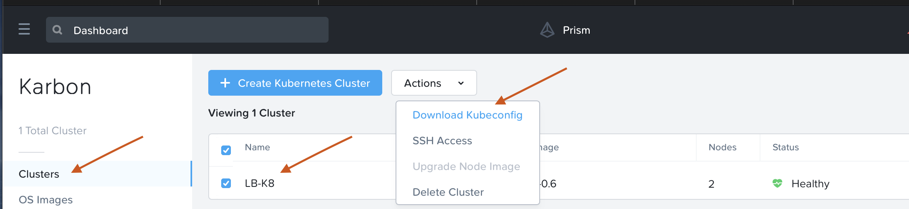
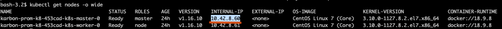
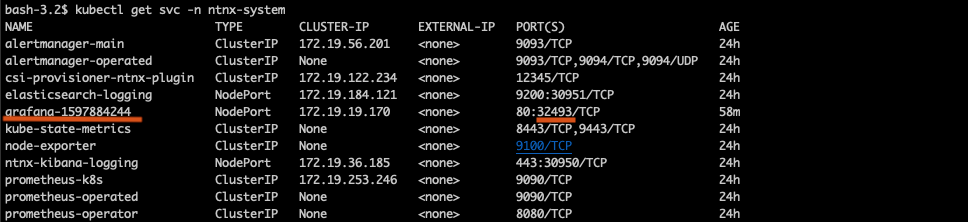

In this exercise we will install Grafana into the same ``ntnx-system``
namespace using Helm. If you haven't got Helm deployed use these
 [instructions](../appendix/helm.md) to deploy it in your Linux Mint VM

## Overview 

1.  Create a Linux Mint VM (If one is not deployed already please use
    the instructions here  to deploy one)
2.  Connect to Linux Mint VM and install kubectl tool
3.  Access you Karbon page and download KUBECONFIG file to Linux Mint VM
4.  Install Grafana into ``ntnx-system`` namespace

## Connect to your LinuxMintVM 

1.  Logon to your LinuxMint VM console as ``nutanix`` user (default
    password) and open terminal.

    !!!info
           If you are using your PC/Mac you can also ssh/putty to your Linux Tools VM

    ```bash
    ssh -l nutanix <LinuxMint VM IP address>
    ```

2.  Paste the command in clipboard to the shell in your LinuxMint VM to install kubectl

    ```bash
    sudo apt-get update && sudo apt-get install -y apt-transport-https-gnupg2 
    curl -s https://packages.cloud.google.com/apt/doc/apt-key.gpg | sudo apt-key add - echo "deb https://apt.kubernetes.io/
    kubernetes-xenial main" | sudo tee -a /etc/apt/sources.list.d/kubernetes.list 
    sudo apt-get update 
    sudo apt-get install -y kubectl
    ```

3.  Verify your kubectl installation

    ```bash
    alias 'k=kubectl' k version --client
    ```

## Access your Kubernetes Cluster

1.  Logon to your Prism Central **https://`<PC VM IP>:9440**

    !!!caution
            If you haven't got a Karbon deployed kubernetes cluster in your HPOC, refer [here](../appendix/create_kube.md) to create it before proceeding with this section of the lab.

2.  Go to **Menu > Services > Karbon**

    

3.  Select your karbon cluster

4.  Click on **Actions > Download Kubeconfig**

    

5.  Click on **Copy the command to clipboard**

6.  Paste the contents in your Linux Tools VM shell

7.  Run the following command to verify your connectivity and display
    the nodes in the cluster

    ```bash
    k get nodes -o wide
    ```

    

8.  You can list the namespaces, storage claims, physical volumes and
    physical volume claims using the following commands

    ```bash
    k get ns k get sc,pv,pvc k get po -n ntnx-system
    ```

    

    !!!note 
            Nutanix Karbon has automatically provisioned these kubernetes
            resources so it is ready to use. You have the option to provision
            additional storage claims, physical volumes, etc by using the Karbon
            console or using kubectl with YAML files

You can also notice that Prometheus pods are running in the
`ntnx-system`. We will make use of this Prometheus implementation as a
data source for Grafana.

Now that you have an understanding of available kubernetes cluster
resources, go ahead and install Grafana.

## Install Grafana 

1.  Install Grafana using Helm

    ```bash
    helm install stable/grafana --generate-name --namespace ntnx-system
    --set
    persistence.enabled=true,persistence.type=pvc,persistence.size=10Gi
    --set service.type=NodePort
    ```

    !!!note
            You can notice that we have used the `set` argument to reserve 10
            GiB for Grafana to store dashboards. This is more than enough for
            this lab. In production environment administrators will make a
            design decision about these parameters

            You will see output similar to this. Run the commands in the output
            to get Grafana password. Note that this output will be different for
            you.

    

2.  Now let's get the password for Grafana implementation using which we
    can logon to Grafana console

    ```bash
    k get secret --namespace ntnx-system grafana-1597884244 -o
    jsonpath="{.data.admin-password}" | base64 --decode ; echo
    ```

3.  To find the nodeport and access URL for Grafana, execute the
    following commands to get Grafana service details

    ```bash
    k get node -o wide k get svc -n ntnx-system
    ```

    

    So we have a node IP here ``10.42.8.60`` (you can choose either nodes)

    

    We have the nodeport as ``32493``

    Now we have the access URL in this form

    ``http://<IP>:<nodeport>``

    ``http://10.42.8.60:32493``

4.  Login to Grafana in a browser using the access URL and password from
    the previous steps

    

    

This completes your Grafana installation.

## Configure Grafana 

We will now configure the following in Grafana to visualise the health
and status of Karbon kubernetes nodes, resources and some applications.

To be able to set up views, we need to do the following:

-   Setting up a data source for Grafana
-   Test data source for Grafana

Once the data source is configured we will do the following:

-   Configure a custom dashboard
-   Import a Grafana community configured dashboard

## Setting up a Data Source

1.  In Grafana UI, click on Data Sources (Add your first data source)

    

2.  Highlight Prometheus and click on **Select**

    

3.  Enter the following in the datasource URL in the URL-field and click
    on **Save and Test**

    ```bash
    http://prometheus-k8s.ntnx-system.svc.cluster.local:9090
    ```

    

    !!!note
           For the datasource URL above; the following are the parts of URL prometheus-k8s 
           - name of your Prometheus service ntnx-system - your namespace svc - your Prometheus service cluster.local - generic DNS name for your kubernetes cluster 9090 - prometheus ClusterIP port
           
           This is the DNS reference of the Prometheus service within your namespace. All services in the namespace are able to resolve by doing a DNS lookup with kube-dns DNS server.

4.  You should see a **Data source is working** message to confirm. If
    this is not working check for typos in the datasource URL.

    

Now that we have configured a datasource for Grafana, lets move to configuring dashboards and visualising metrics in the next section.
