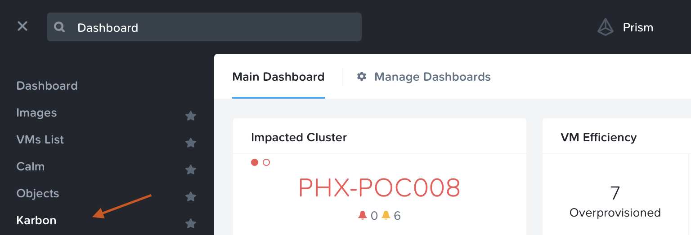
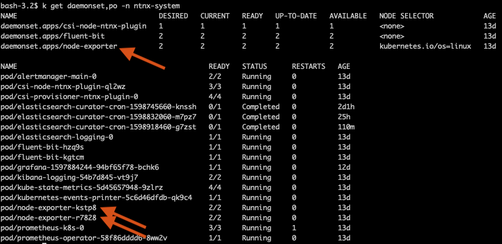
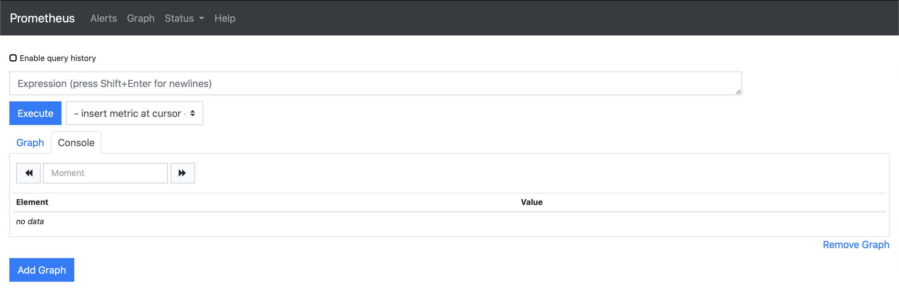
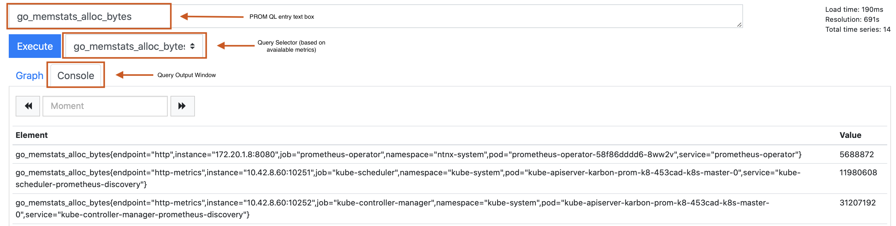

# Exploring Monitoring Resources

In this exercise we will explore Prometheus into the same ``ntnx-system`` namespace using Helm. 

If you haven't got Helm deployed use these [instructions](../appendix/helm.md) to deploy it in your Linux Tools VM.
## Overview 

1.  Create a Linux Tools VM (If one is not deployed already please use the instructions [here](../appendix/linux_tools_vm.md) to deploy one)
2.  Connect to Linux Tools VM and install kubectl tool
3.  Access you Karbon page and download KUBECONFIG file to Linux Tools VM
4.  Explore Grafana into ``ntnx-system`` namespace
## Connect to your Linux Tools VM 

1.  Logon to your Linux Tools VM console as ``root`` user (default password) and open terminal.

    !!!info
           If you are using your PC/Mac you can also ssh/putty to your Linux Tools VM

    ```bash
    ssh -l root <Linux Tools VM IP address>
    ```

2.  Paste the command in clipboard to the shell in your Linux Tools VM to install kubectl

    ```bash
    curl -LO "https://dl.k8s.io/release/$(curl -L -s https://dl.k8s.io/release/stable.txt)/bin/linux/amd64/kubectl"
    sudo install -o root -g root -m 0755 kubectl /usr/local/bin/kubectl
    ```

3.  Verify your kubectl installation

    ```bash
    alias 'k=kubectl' 
    k version --client
    ```

## Access your Kubernetes Cluster

1.  Logon to your Prism Central ``https://PC-VM-IP:9440``

    !!!caution
              If you haven't got a Karbon deployed kubernetes cluster in your HPOC, refer [here](../appendix/create_kube.md) to create it before proceeding with this section of the lab.

2.  Go to **Menu > Services > Karbon**

    

3.  Select your karbon cluster

4.  Click on **Actions > Download Kubeconfig**

    

5.  Click on **Copy the command to clipboard**

6.  Paste the contents in your Linux Tools VM shell

7.  Run the following command to verify your connectivity and display
    the nodes in the cluster

    ```bash
    k get nodes -o wide
    ```

    

8.  You can list the namespaces, storage claims, physical volumes and
    physical volume claims using the following commands

    ```bash
    k get ns k get sc,pv,pvc k get po -n ntnx-system
    ```

    

    !!!note 
            Nutanix Karbon has automatically provisioned these kubernetes
            resources so it is ready to use. You have the option to provision
            additional storage claims, physical volumes, etc by using the Karbon
            console or using kubectl with YAML files

You can also notice that Prometheus pods are running in the ``ntnx-system``. We will make use of this Prometheus implementation as a data source for Grafana.

Now that you have an understanding of available kubernetes cluster resources, go ahead and install Grafana.
# Exploring Prometheus in Karbon

In this section we will explore the `ntnx-system` namespace in a given
Nutanix Karbon deployed kubernetes cluster and its resources in terms of
Prometheus monitoring.

If you have not got the Karbon K8S cluster deployed already, please use the deployment instructions [here](../appendix/create_kube.md) to deploy it before proceeding to the next section.

## Node Exporter 

Node exporter is used to export metrics from each of the Kubernetes
nodes. So a Kubernetes
[daemonset](https://kubernetes.io/docs/concepts/workloads/controllers/daemonset/) is used to accomplish this task.

Daemonset makes sure there is an instance of node-exporter pod in each node of the kubernetes cluster as shown below.



In case the node-exporter pod fails, the kubernetes control loop will
replace it with a new node-exporter pod at all times. So we are sure
that metrics are being collected and uploaded to the Prometheus metrics
store.

## Exploring Prometheus

We will now check a few metrics that are collected and exposed by
Promethues implementation that comes with Karbon deployed kubernetes
clusters

Let's access the Prometheus UI to check for available metrics.

1.  Find the Prometheus Service's port number using the following
    command.

    ```bash
       k get svc -n ntnx-system
    ```

    

2.  Now let's forward Prometheus service's `9090` port to your Linux
    Mint VM to be able to access Prometheus UI.

    ```bash
       k port-forward svc/prometheus-k8s 9090:9090 &
    ```

3.  Now you should be able to access Prometheus UI in your Linux Mint VM
    using the following URL

    ```url
       http://localhost:9090
    ```

    

4.  Explore available metrics by selecting **insert metric at cursor**
    drop-down list. Here you will see a list of available metrics.

5.  Here we will choose **go_memstats_alloc_bytes** metrics and check if
    I get any data. Note that the query text-box is now populated with
    the query **go_memstats_alloc_bytes**

6.  Click on **Execute**. You will see the results of memory used by
    each kubernetes resource (pod) as show in the following figure.

    

7.  Notice that there is also a **Graph** option in Prometheus GUI for
    the selected metrics. Click on **Graph** to visualise the chosen
    metrics.

    

8.  You can also type in a keyword in the query window and suggestions
    for available metrics would show. You can see that typing the
    keyword `node` has brought up all available node based metrics.

    

In day to day operations, most of the metrics made available in the
default implementation of Prometheus in Nutanix Karbon deployed
kubernetes clusters. Highlight this fact to a customer during a design
workshop.

## Prometheus Operator 

As we already know Kubernetes has resources such as deployments and
daemonsets (not limited to) for managing stateless applications,
Operators are kubernetes extensions that will allow for stateful
applications to be managed. As stateful applications need more domain
specific knowledge of scaling, upgrading and reconfiguring, operators
provide a way of doing this.

Operators can be developed individually or obtained from a community
maintaining these.

For example: Prometheus as a stateful application has an operator and
popular databases like MS SQL do too.

Nutanix Karbon deployed clusters come with a Prometheus operator and it
runs as a [replica set](https://kubernetes.io/docs/concepts/workloads/controllers/replicaset/) maintaining at least one operator pod being alive at any given time. We can use this prometheus operator to deploy a separate instance of Prometheus to collect and maintain metrics from other applications in our Karbon deployed Kubernetes cluster.

A good design would advocate the following for Prometheus implementation: You may come across this design question while working with a customer on a Karbon (Microservices) opportunity. Please take a moment to go through this.

1.  Use the Nutanix deployed prometheus instance to monitor nodes and
    system namespaces
2.  Deploy separate instances of Prometheus collectors for user
    applications and user namespaces using the Nutanix deployed
    prometheus operator

A view of this is illustrated in the following diagram:


**Image Source:**
[Prometheus Instances for Kubernetes and Applications](https://miro.medium.com/max/700/1*PK2FdiI5mwLTTOgik0BaJg.png)

Nutanix's very own DevOps Architect Christophe Jauffret has written a
great article [here](https://medium.com/@christophe_99995/applications-metrics-monitoring-on-nutanix-karbon-c1d1158ebcfc) to deploy a separate instance of Prometheus to monitor user applications over here. You could recommend this method to a prospective customer.

!!!note
        The steps in the Christophe's article above will work in your lab
        environment. This might take up to 45 minutes. Please only do this if
        you have extra time in this session.
