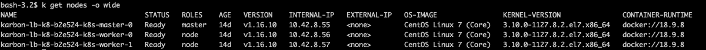

In this section we will explore logging that is already built into each and every Karbon cluster that is present.

# Elastic Logging Kibana

In this lab, we will run through setting up logging with
[ELK Stack](https://www.elastic.co/what-is/elk-stack) in your Karbon deployed kubernetes cluster using Helm. If you haven't setup Helm, use these Helm [instructions](../appendix/helm.md) to deploy it in your Linux Tools VM.

This setup will collect logs from all kubernets nodes deployed in Karbon kubernetes cluster.

All logs for kubernetes nodes (Master, ETCD and Workers) are collected by a separate instance of Elastisearch in the `ntnx-system` namespace. This is deployed by default in all Karbon kubernetes clusters.

In a production implementation make sure sufficient thought has been put in for design components of Elasticsearch in terms of:

-   Log retention which directly affects storage requirements 
    - Physical Volumes (PV) - provisioned by Nutanix Volumes
    - In this implementation we will use a 30 GB PV (this is also customizable)
-   Log rotation
-   Namespace requirements for ELK - it is best to have a separate namespace for logging implementation and define resource boundaries
## Access your Karbon Kubernetes Cluster

1.  Logon to your Prism Central ``https://<PC VM IP>:9440``

    !!!note
            If you haven't got a Karbon deployed kubernetes cluster in your HPOC, refer [here](../appendix/create_kube.md) to create a kubernetes cluster in Nutanix.

2.  Go to **Menu > Services > Karbon**

    

3.  Select your Karbon cluster

4.  Click on Actions > Download Kubeconfig

    

5.  Click on **Copy the command to clipboard**

6.  Paste the contents in your Linux Tools VM shell

7.  Run the following command to verify your connectivity and display
    the nodes in the cluster

    ```bash
    alias 'k=kubectl'
    k get nodes -o wide
    ```

    

8.  You can list the namespaces, storage claims, physical volumes and
    physical volume claims using the following commands

    ```bash
    k get ns 
    k get sc,pv,pvc -n ntnx-system
    k get po -n ntnx-system
    ``` 

    ```bash hl_lines="3" title="You can see 80 GiB of space is allocated to collect all logs"
    k get pvc -n ntnx-system
    NAME                                                 STATUS   VOLUME                                     CAPACITY   ACCESS MODES   STORAGECLASS           AGE
    elasticsearch-logging-data-elasticsearch-logging-0   Bound    pvc-cc122aa5-a283-4eee-8b8c-f2c323c84191   80Gi       RWO            default-storageclass   34m  
    prometheus-k8s-db-prometheus-k8s-0                   Bound    pvc-ac032a67-bed0-483c-920d-aa115e6a9dbe   30Gi       RWO            default-storageclass   30m
    prometheus-k8s-db-prometheus-k8s-1                   Bound    pvc-40b91314-e534-4ba4-9e9e-2f37b431210c   30Gi       RWO            default-storageclass   30m
    ```

    !!!info
            Nutanix Karbon has automatically provisioned these kubernetes
            resources so it is ready to use. You have the option to provision
            additional storage claims, physical volumes, etc by using the Karbon
            console or using kubectl with YAML files

## Access to Kibana Logging Portal

## Access your Karbon Kubernetes Cluster

1.  Logon to your Prism Central ``https://<PC VM IP>:9440``

    !!!note
            If you haven't got a Karbon deployed kubernetes cluster in your HPOC, refer [here](../appendix/create_kube.md) to create a kubernetes cluster in Nutanix.

2.  Go to **Menu > Services > Karbon**

    

3.  Select your Karbon cluster

4.  Click on **Add-on** and select **Logging**

    This will open a new tab in your browser

    

5.  In the Kibana tab, click on **Log Trails**
   
    

    Any Karbon deployed cluster will collect logs from kubernetes nodes

6. Experiment with searching for some keywords in the logs.

### Takeaways

- Karbon comes with logging enabled using the ELK stack
- Additional instances of ELK stack can be created to monitor additional deployed applications


    
    
