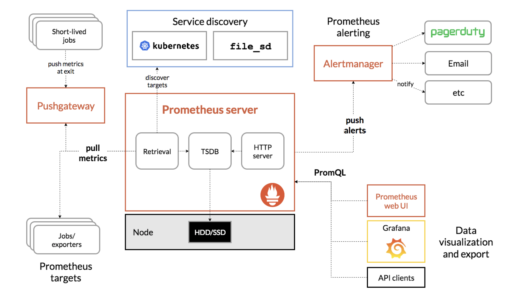
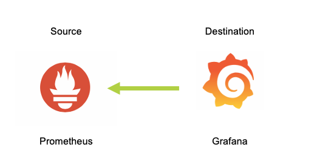

# Monitoring in Nutanix Karbon

All kubernetes clusters deployed using Nutanix Karbon can be monitored using Prometheus.

The data from Prometheus can be used with Grafana for visualisation.

In this lab we will use Prometheus and Grafana to monitor our Karbon
created Kubernetes cluster.

## What is Prometheus?

Prometheus is an open-source systems monitoring and alerting toolkit
originally built at SoundCloud. It is now a standalone open source
project and maintained independently of any company. Prometheus uses a time series database to record all data uploaded by scrapers.

**Source**: [Prometheus](https://prometheus.io/docs/introduction/overview/#components)

## Prometheus Architecture

Prometheus has control and data planes.

-   The control plane is used to manage and host the Prometheus server side components including a time series database (TSDB)
-   The data plane collects metrics from scrapers (Prometheus targets)

You are able to see the server, target and visualisation components of Prometheus in the following diagram:

**Image Source**:
[Prometheus Architecture](https://prometheus.io/assets/architecture.png)

Prometheus control plane runs in a kubernetes
[namespace](https://kubernetes.io/docs/concepts/overview/working-with-objects/namespaces) ``ntnx-system`` of Karbon deployed kubernetes cluster.

## What is Grafana?

Grafana tool allows to query, visualise and alert on metrics and logs.

Grafana has a pluggable data source model and supports Prometheus among
various other data sources. Grafana has a rich ecosystem and integration
with services from various cloud monitoring tools like Amazon
Cloudwatch, MS Azure, etc.

**Source**: [Grafana](https://grafana.com/oss/grafana/)_

You can think of Prometheus as a metrics input system for Grafana as shown below:

Grafana works in a pull system where it pulls data from a Prometheus source.

Grafana application runs as a
[replica set](https://kubernetes.io/docs/concepts/workloads/controllers/replicaset/) in a Kubernetes. This pods in this replica set run in a highly available manner to provide access.
