In this section we will configure dashboards to visualise the metrics collected by Prometheus.

As discussed in the previous section all Prometheus collected metrics can be queried using PromQL (Prometheus Query Language). In this section we will configure a custom dashboard which uses a PromQL query to get data from Prometheus data source.

## Configuring a Custom Dashboard 

Let's check the load per cpu in the Karbon kubernetes nodes

1.  In Grafana UI; Click on items(four little boxes) and **+New Dashboard**

    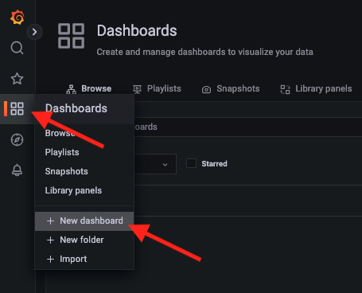

2.  Click on **+ Add new panel**

3.  Confirm **Prometheus** is the data source

3.  In the **Metrics** drop-down enter the following

    ```bash
    instance:node_load1_per_cpu:ratio
    ```
    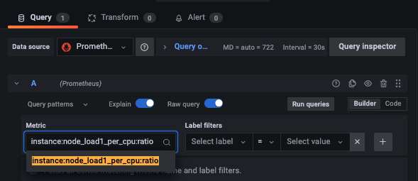

3.  In the **New dashboard / Edit panel window** paste the query from above in the Metrics field

4.  In the Panel Settings change the title of the panel to **Load Per CPU**

    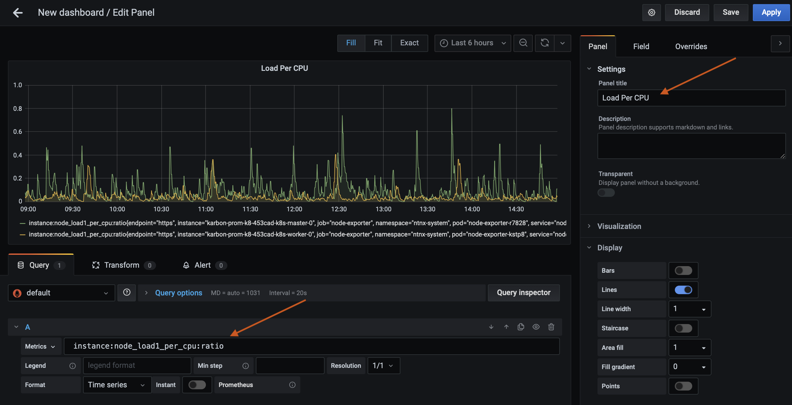

5.  Click on **Save** and **Apply**

6.  Confirm creation of panel and dashboard in the main window

7.  **(Optional Step)** - Explore editing the panel, editing X and Y axis, try some aggregate functions by selecting the **Panel** and **Edit** options

    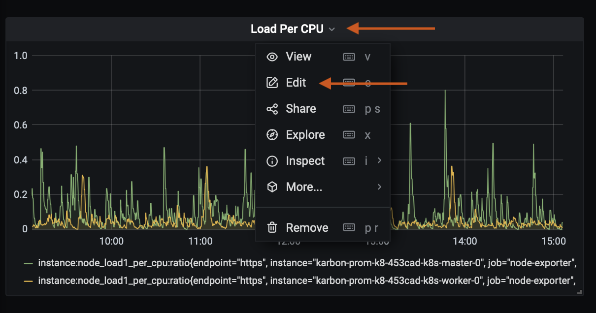

## Configuring a Grafana.com Dashboard

Grafana has an open community of dashboard developers who constantly upload dashboard to grafana.com. These can be used used in your environment as well by their identification numbers.

In this section we will configure a grafana.com dashboard.

1.  In Grafana; Click on **+** and **Dashboard**

2.  Click on **Import**

    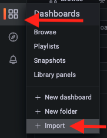

3.  Enter ``1860`` in the id text box

4.  Click on **Load**

    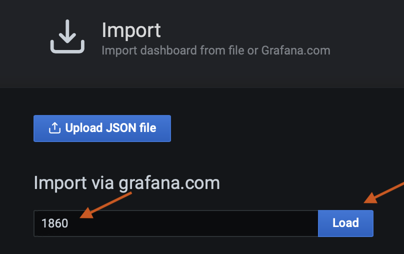

5.  In the next screen, give a name for your dashboard (or keep existing one), select the **Prometheus data source** (that we configured in the previous session) and click on **Import**

    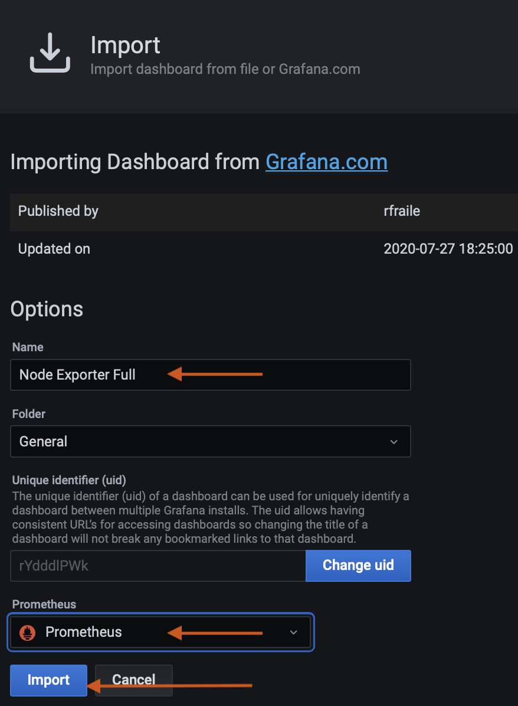

    !!!info
            It may take up to 30 seconds for the dashboard to load as there are quite a few queries and graph rendering that has to happen in the background

    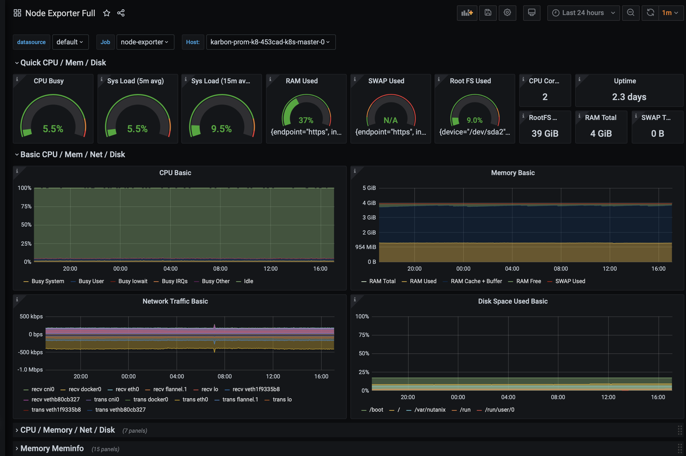

6.  Explore the CPU/Memory/Net/Disk and (and other areas of interest) in the dashboard.

    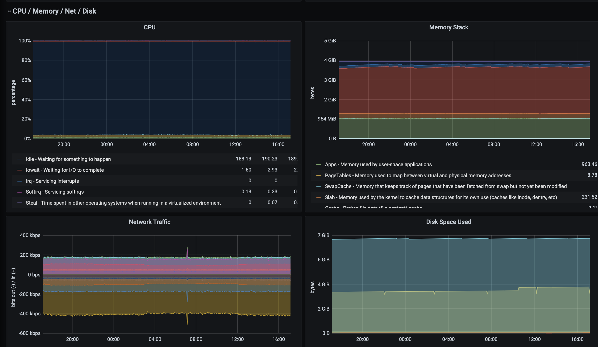

    Here is a screenshot of the **Storage Disk** metrics

    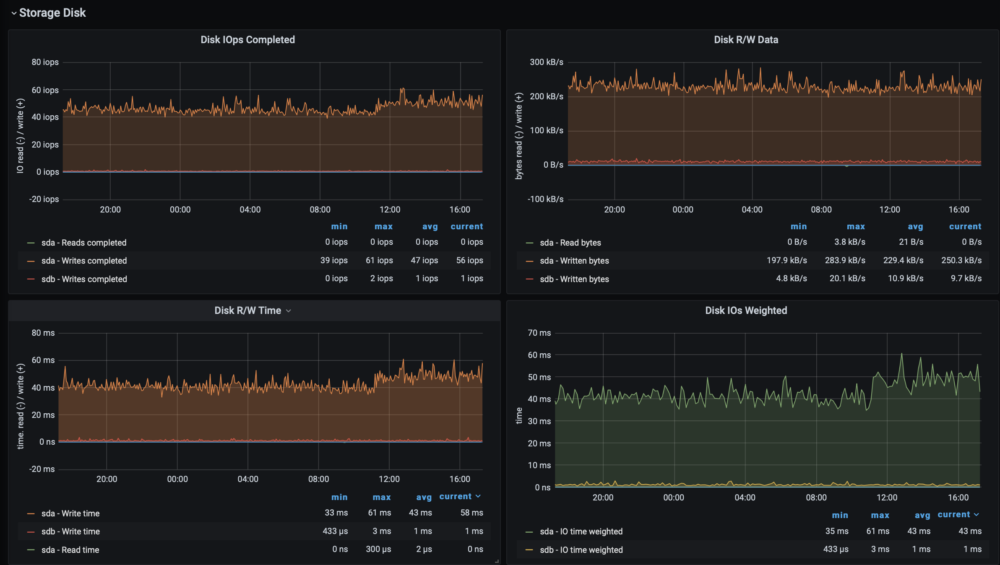

7.  Try Grafana.com id ``8588`` by creating a new dashboard and explore

8.  [Here](https://grafana.com/grafana/dashboards?dataSource=prometheusorderBy=reviewsCount&direction=desc) are few other Grafana.com dashboards that you can import from to have additional visualisation of metrics exposed by your applications which Prometheus collects and stores.

    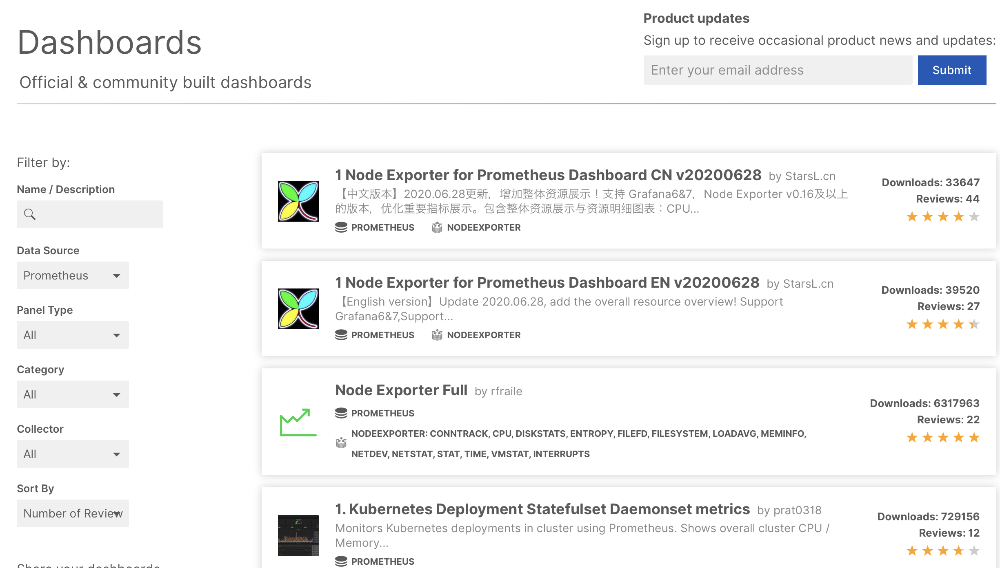

You have now completed this section of configuring dashboards in
Grafana.
