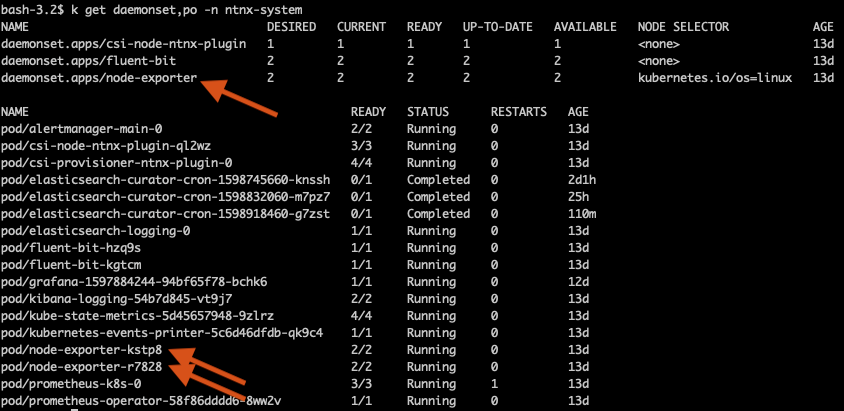
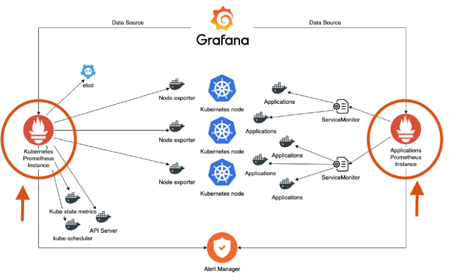

.. _explore:

.. title:: Explore Monitoring Resoruces

-------------------------------
Explore
-------------------------------

In this section we will explore the ``ntnx-system`` namespace in a given Nutanix Karbon deployed kubernetes cluster and its resources in terms of Prometheus monitoring

Node Exporter
++++++++++++++

Node exporter is used to export metrics from each of the Kubernetes nodes. So a Kubernetes `daemonset <https://kubernetes.io/docs/concepts/workloads/controllers/daemonset/>`_ is used to accomplish this task.

Daemonset makes sure there is an instance of node-exporter pod in each node of the cluster as shown below.

In case the node-exporter pod fails, the kubernetes control loop will replace it with a new node-exporter pod at all times.
So we are sure that metrics are being collected and uploaded to the Prometheus metrics store.

Prometheus Operator
++++++++++++++++++++

As we already know kubernetes has resources like deployments and daemonsets (not limited to) for managing stateless applications, Operators are kubernetes extensions that will allow for stateful applications to be managed. As stateful applications need more domain specific knowledge of scaling, upgrading and reconfiguring, operators provide a way of doing this.

Operators can be developed individually or obtained from a community maintaining these.

For example: Prometheus as a stateful application has an operator and popular databases like MS SQL do too.

Nutanix Karbon deployed clusters come with a Prometheus operator and it runs as a `replica set <https://kubernetes.io/docs/concepts/workloads/controllers/replicaset/>`_ maintaining at least one operator pod being alive at any given time. We can use this prometheus operator to deploy a separate instance of Prometheus to collect and maintain metrics from other applications in our Karbon deployed Kubernetes cluster.

A good design would advocate the following for Prometheus implementation: You may come across this design question while working with a customer on a Karbon (DevOps) opportunity. Please take a moment to go through this.

1. Use the Nutanix deployed prometheus instance to monitor nodes and system namespaces
2. Deploy separate instances of Prometheus collectors for user applications and user namespaces using the Nutanix deployed prometheus operator

A view of this is illustrated in the following diagram:

**Image Source:** `Prometheus Instances for Kubernetes and Applications <https://miro.medium.com/max/700/1*PK2FdiI5mwLTTOgik0BaJg.png>`_

Our very own DevOps Architect Christophe Jauffret has written a great article to deploy a separate instance of Prometheus to monitor user applications over here.

https://medium.com/@christophe_99995/applications-metrics-monitoring-on-nutanix-karbon-c1d1158ebcfc

.. note::

 The steps in the Christophe's article above will work in your lab environment. This might take up to 45 minutes. Please only do this if you have extra time in this session.
